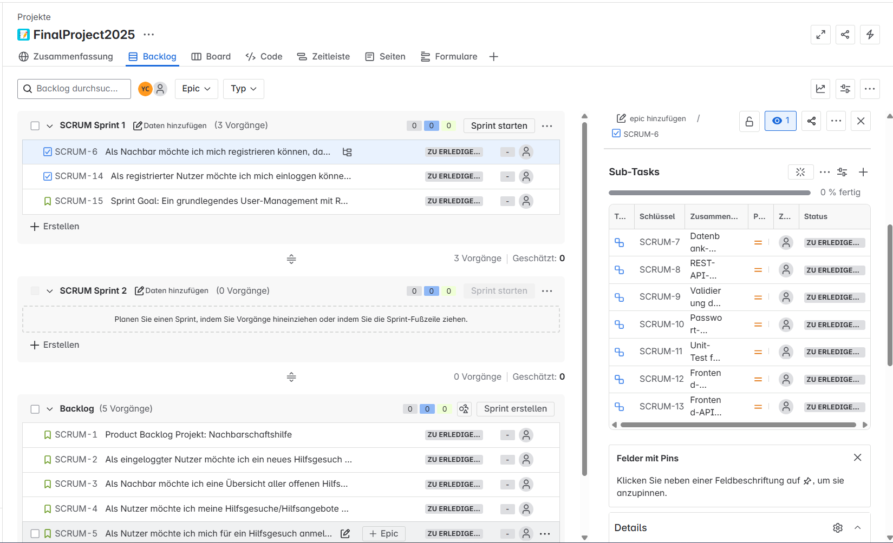

# Nachbarschaftshilfe-Projekt

Willkommen beim Nachbarschaftshilfe-Projekt! Dies ist ein Webservice zur Unterstützung und Koordination von Nachbarschaftshilfe in Ihrer Umgebung.

## Projektübersicht

Dieses Repository enthält den Code für eine Nachbarschaftshilfe-Plattform, die es Nachbarn ermöglicht:
- Hilfsgesuche zu erstellen und zu verwalten
- Sich gegenseitig bei alltäglichen Aufgaben zu unterstützen
- Eine stärkere Gemeinschaft aufzubauen

## Technische Dokumentation

Die wichtigsten Projektdokumente finden Sie im `docs`-Ordner:

- [Technischer Plan](docs/technical_plan.md) - Enthält die detaillierte technische Planung und Architektur
- [Definition of Done](docs/DoD.md) - Checkliste mit Qualitätskriterien für Projektabschluss
- [Product Backlog](docs/product-backlog.md) - Enthält das initiale Product Backlog. Das Backlog ist lebendig – es wird regelmäßig ergänzt und angepasst.

Der technische Plan umfasst dabei:
- Detaillierte Architektur & Komponenten
- Datenbank-Schema-Design
- Technologie-Stack (Frontend/Backend)
- Kubernetes Deployment Design
- Infrastructure as Code (Terraform) Design
- CI/CD Pipeline Design
- Test- und Security-Planung
- Monitoring & Logging Konzept
- Umsetzungszeitplan

## Technologie-Stack

Das Projekt verwendet moderne Webtechnologien:
- Frontend: React + Vite + TypeScript + TailwindCSS
- Backend: Node.js + Express
- Datenbank: PostgreSQL
- Authentifizierung: JWT + Bcrypt
- Infrastructure: Kubernetes + Terraform (optional)

## Projektstart

Die Implementierung dieses Projekts ist für das Jahr 2025 geplant. Details zur Umsetzung und den einzelnen Projektphasen finden Sie im technischen Plan.

## Anmerkung

Dies ist ein Planungsdokument für ein Abschlussprojekt. Die tatsächliche Implementierung und der Code folgen in späteren Phasen des Projekts.

Bevor die Projektphase startet, haben wir uns im Team zusammengesetzt und ein Sprint-Planning-Meeting gehalten. Nachfolgend das Resultat des Meetings und unser Ziel des ersten Sprints:

## Sprint 1

### Sprint Goal

Ein grundlegendes User-Management mit Registrierung und Login bereitstellen, um erste Nutzerinteraktionen zu ermöglichen.

### Inhalte des Sprints

Für Sprint 1 wurden folgende User Stories aus dem priorisierten Product Backlog ausgewählt:

- SCRUM-6: Als Nachbar möchte ich mich registrieren können, damit ich Hilfsgesuche und Hilfsangebote anlegen oder besuchen kann.
- SCRUM-14: Als registrierter Nutzer möchte ich mich einloggen können, damit ich Zugang zu meinem Konto habe.
- SCRUM-15: Sprint Goal: Ein grundlegendes User-Management mit Registrierung und Login bereitstellen, um erste Nutzerinteraktionen zu ermöglichen.

Diese User Stories wurden in konkrete technische Aufgaben (Sub-Tasks) unterteilt, zum Beispiel:

Für SCRUM-6 (Registrierung):

- SCRUM-7: Datenbank-Tabelle User anlegen
- SCRUM-8: REST-API-Endpoint POST /register implementieren
- SCRUM-9: Validierung der Eingabedaten (E-Mail, Passwort)
- SCRUM-10: Passwort-Hashing (mit bcrypt)
- SCRUM-11: Unit-Test für Registrierung
- SCRUM-12: Frontend-Formular erstellen
- SCRUM-13: Frontend-API-Call implementieren

Alle Aufgaben wurden im Jira-Board dokumentiert.

### Jira Board

Das Sprint Backlog sowie alle User Stories und Sub-Tasks sind im folgenden öffentlichen Jira-Board einsehbar:

https://helpinghands2025.atlassian.net/jira/software/projects/SCRUM/boards/1/backlog?selectedIssue=SCRUM-5

### Screenshot

