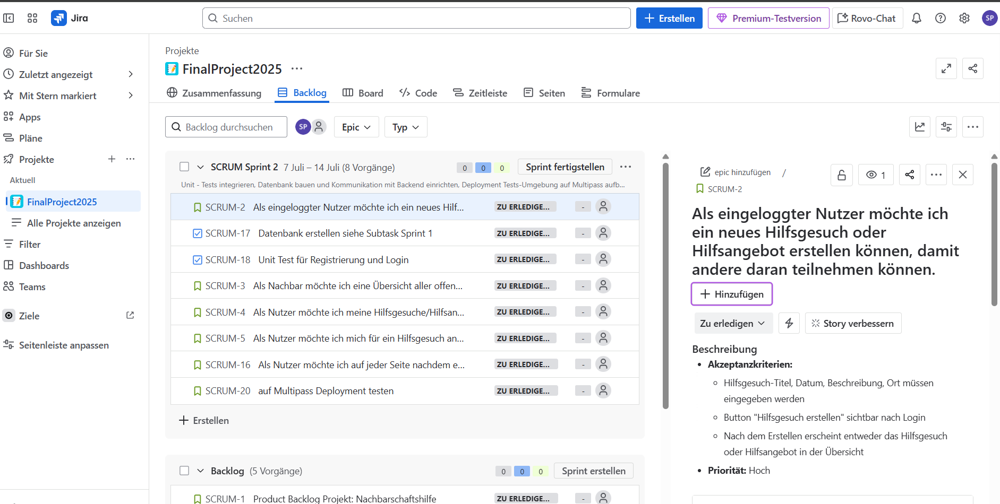

# Nachbarschaftshilfe-Projekt

Willkommen beim Nachbarschaftshilfe-Projekt! Dies ist ein Webservice zur Unterstützung und Koordination von Nachbarschaftshilfe in Ihrer Umgebung.

## Projektübersicht

Dieses Repository enthält den Code für eine Nachbarschaftshilfe-Plattform, die es Nachbarn ermöglicht:
- Hilfsgesuche zu erstellen und zu verwalten
- Sich gegenseitig bei alltäglichen Aufgaben zu unterstützen
- Eine stärkere Gemeinschaft aufzubauen

## Technische Dokumentation

Die wichtigsten Projektdokumente finden Sie im `docs`-Ordner:

- [Technischer Plan](docs/technical_plan.md) - Enthält die detaillierte technische Planung und Architektur
- [Definition of Done](docs/DoD.md) - Checkliste mit Qualitätskriterien für Projektabschluss
- [Product Backlog](docs/product-backlog.md) - Enthält das initiale Product Backlog. Das Backlog ist lebendig – es wird regelmäßig ergänzt und angepasst.

Der technische Plan umfasst dabei:
- Detaillierte Architektur & Komponenten
- Datenbank-Schema-Design
- Technologie-Stack (Frontend/Backend)
- Kubernetes Deployment Design
- Infrastructure as Code (Terraform) Design
- CI/CD Pipeline Design
- Test- und Security-Planung
- Monitoring & Logging Konzept
- Umsetzungszeitplan

## Technologie-Stack

Das Projekt verwendet moderne Webtechnologien:
- Frontend: React + Vite + TypeScript + TailwindCSS
- Backend: Node.js + Express
- Datenbank: PostgreSQL
- Authentifizierung: JWT + Bcrypt
- Infrastructure: Kubernetes + Terraform (optional)

## Projektstart

Die Implementierung dieses Projekts ist für das Jahr 2025 geplant. Details zur Umsetzung und den einzelnen Projektphasen finden Sie im technischen Plan.

## Anmerkung

Dies ist ein Planungsdokument für ein Abschlussprojekt. Die tatsächliche Implementierung und der Code folgen in späteren Phasen des Projekts.

Bevor die Projektphase startet, haben wir uns im Team zusammengesetzt und ein Sprint-Planning-Meeting gehalten. Nachfolgend das Resultat des Meetings und unser Ziel des ersten Sprints:

## Sprint 1

### Sprint Goal

Ein grundlegendes User-Management mit Registrierung und Login bereitstellen, um erste Nutzerinteraktionen zu ermöglichen.

### Inhalte des Sprints

Für Sprint 1 wurden folgende User Stories aus dem priorisierten Product Backlog ausgewählt:

- SCRUM-6: Als Nachbar möchte ich mich registrieren können, damit ich Hilfsgesuche und Hilfsangebote anlegen oder besuchen kann.
- SCRUM-14: Als registrierter Nutzer möchte ich mich einloggen können, damit ich Zugang zu meinem Konto habe.
- SCRUM-15: Sprint Goal: Ein grundlegendes User-Management mit Registrierung und Login bereitstellen, um erste Nutzerinteraktionen zu ermöglichen.

Diese User Stories wurden in konkrete technische Aufgaben (Sub-Tasks) unterteilt, zum Beispiel:

Für SCRUM-6 (Registrierung):

- SCRUM-7: Datenbank-Tabelle User anlegen
- SCRUM-8: REST-API-Endpoint POST /register implementieren
- SCRUM-9: Validierung der Eingabedaten (E-Mail, Passwort)
- SCRUM-10: Passwort-Hashing (mit bcrypt)
- SCRUM-11: Unit-Test für Registrierung
- SCRUM-12: Frontend-Formular erstellen
- SCRUM-13: Frontend-API-Call implementieren

Alle Aufgaben wurden im Jira-Board dokumentiert.

### Jira Board

Das Sprint Backlog sowie alle User Stories und Sub-Tasks sind im folgenden öffentlichen Jira-Board einsehbar:

https://helpinghands2025.atlassian.net/jira/software/projects/SCRUM/boards/1/backlog?selectedIssue=SCRUM-5

### Screenshot

## Sprint 2

### Sprint Goal

Die Datenbank installieren und Strukturen aufbauen, sowie die Kommunikation zum Backend herstellen.
Zusätzlich soll nach jedem Sprint ein Backup durchgeführt werden. Geplant ist außerdem ein erstes Test-Deployment, zum Beispiel auf Multipass,
um eventuelle Probleme frühzeitig zu erkennen. Darüber hinaus möchten wir Unit-Tests integrieren.

### Inhalte des Sprints

Für Sprint 2 wurden folgende User Stories aus dem priorisierten Product Backlog ausgewählt:

- SCRUM-16: Als Nutzer möchte ich auf jeder Seite nachdem erfolgreichen Login sehen, dass ich eine Nachricht erhalten habe.
- SCRUM-17: Zum persistieren der Benutzerdaten und Benutzereingaben möchten wir eine Datenbank erstellen.
- SCRUM-18: Unit Test für Registrierung und Login implementieren.

Die Stories wurden in größere Haupttasks aufgeteilt, um mehr Übersicht zu schaffen. Beispiele dafür sind:
- Aufbau der Datenbank
- Anlegen von Unit-Tests
- Durchführung eines ersten Test - Deployments
- Planung und Durchführung von Backups

Das gesamte Sprint Backlog ist weiterhin im öffentlichen Jira-Board dokumentiert:

https://helpinghands2025.atlassian.net/jira/software/projects/SCRUM/boards/1/backlog

### Screenshot

Reflexion

### Wie hat sich diese Sprint-Planung von der ersten unterschieden? Was lief einfacher oder besser?

Im zweiten Sprint war unser Team besser mit dem Ablauf vertraut, wodurch die Planung strukturierter ablief. 
Wir konnten Aufgaben präziser einschätzen und das Planning Meeting verlief effizienter, da Rollen und Erwartungen bereits klarer waren.

### Welche konkreten Punkte aus eurer Sprint-Retrospektive haben diese Planung beeinflusst? Nennt ein Beispiel.

Wir empfanden die Arbeit mit so vielen unterschiedlichen Subtasks innerhalb einer User-Story als unübersichtlich und haben uns darauf geeinigt einzelne Haupttasks für den zweiten Sprint zu definieren.

### Was ist euer Sprint Goal für den zweiten Sprint, und wie baut es auf dem ersten auf?

Unser Sprint Goal für Sprint 2 ist die Datenbank zu installieren und die Strukturen aufzubauen, sowie die Kommunikation zum Backend zu erstellen. Zusätzlich möchten wir wie in Jira notiert, immer ein Backup 
nach Jedem Sprint durchführen. Plan für diese Woche ist zusätzlich ein Test-Deployment z.B. auf Multipass durchzuführen, um eventuelle Probleme zu indentifizieren. Desweiteren möchten wir
Unit-Tests integrieren.

### Wie habt ihr die Velocity (die im ersten Sprint abgeschlossene Arbeit) genutzt, um den Umfang von Sprint 2 zu bestimmen?

Wir haben im ersten Sprint 10 Story Points abgeschlossen und deshalb einen ähnlichen Umfang für Sprint 2 angesetzt. Damit planen wir realistisch auf Basis erprobter Teamleistung.

### Was ist der Unterschied zwischen dem Product Backlog und dem Sprint Backlog nach eurer zweiten Planung?

Das Product Backlog enthält alle priorisierten Anforderungen und Ideen, die irgendwann umgesetzt werden sollen.

Das Sprint Backlog ist eine Teilmenge davon: Es umfasst nur die Aufgaben, die für den zweiten Sprint konkret ausgewählt, geschätzt und zugeschnitten wurden, inklusive Tasks.

## Präsentation

In dem Ordner (`/presentation`) liegen unsere ersten Entwürfe für die Projektpräsentation.  
Diese Folien, Bilder und Assets sind noch **Work-in-Progress** und werden im Laufe des Projekts weiter ergänzt und verfeinert.  

- Präsentation als PDF oder Google Slides:  https://docs.google.com/presentation/d/1N0Ke-U2M6ElpYKichGh7XkR_fXpQiFjjPzqo6TgIWvE/edit?slide=id.g36b2af83342_0_25#slide=id.g36b2af83342_0_25
- Assets (Logos, Kamerahintergrund etc.): im gleichen Ordner verfügbar

## Projekt-Cockpit

### GitHub Repository  
https://github.com/finalProject2025/TP

### Projektmanagement-Board  
https://helpinghands2025.atlassian.net/jira/software/projects/SCRUM/boards/1/backlog?selectedIssue=SCRUM-5

### Team-Meeting-Raum  
https://meet.google.com/drz-wmvx-pyx

### Daily Scrum  
Mo–Fr um 09:15 Uhr

#### Der Sinn unseres Daily Scrums  
Das Daily Scrum ist ein 15-minütiges Event für die Entwickler des Scrum Teams. 
Der Zweck des Daily Scrums ist es, den Fortschritt in Richtung des Sprint-Ziels zu überprüfen und den Sprint-Backlog bei Bedarf anzupassen, 
um den Arbeitsplan für den nächsten Arbeitstag abzustimmen. Es ist keine Status-Runde für den Product Owner oder Scrum Master, 
sondern ein kurzes Planungsmeeting für das Team selbst, um die Zusammenarbeit und Leistung zu optimieren und eventuelle Hindernisse (Impediments) frühzeitig zu identifizieren.